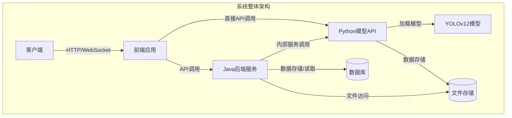
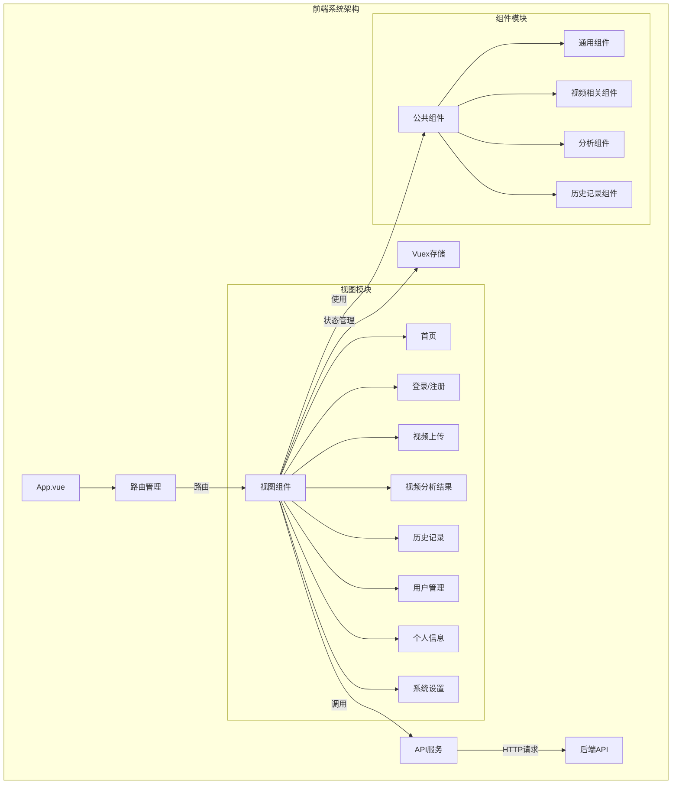
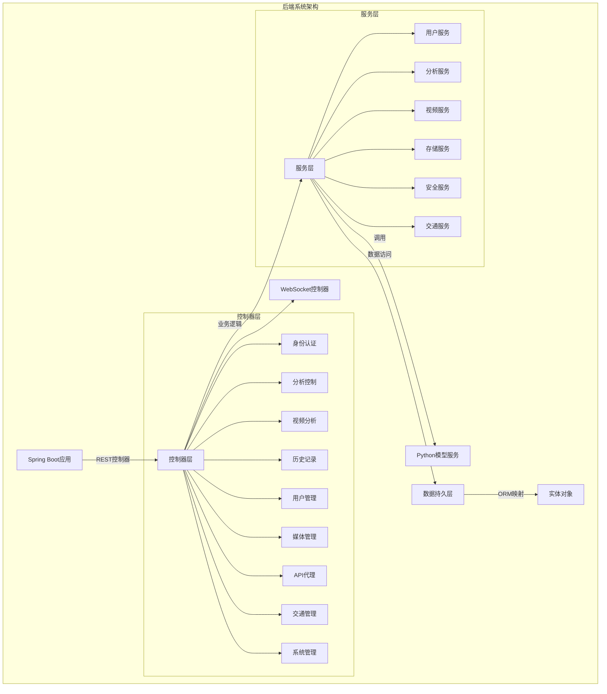
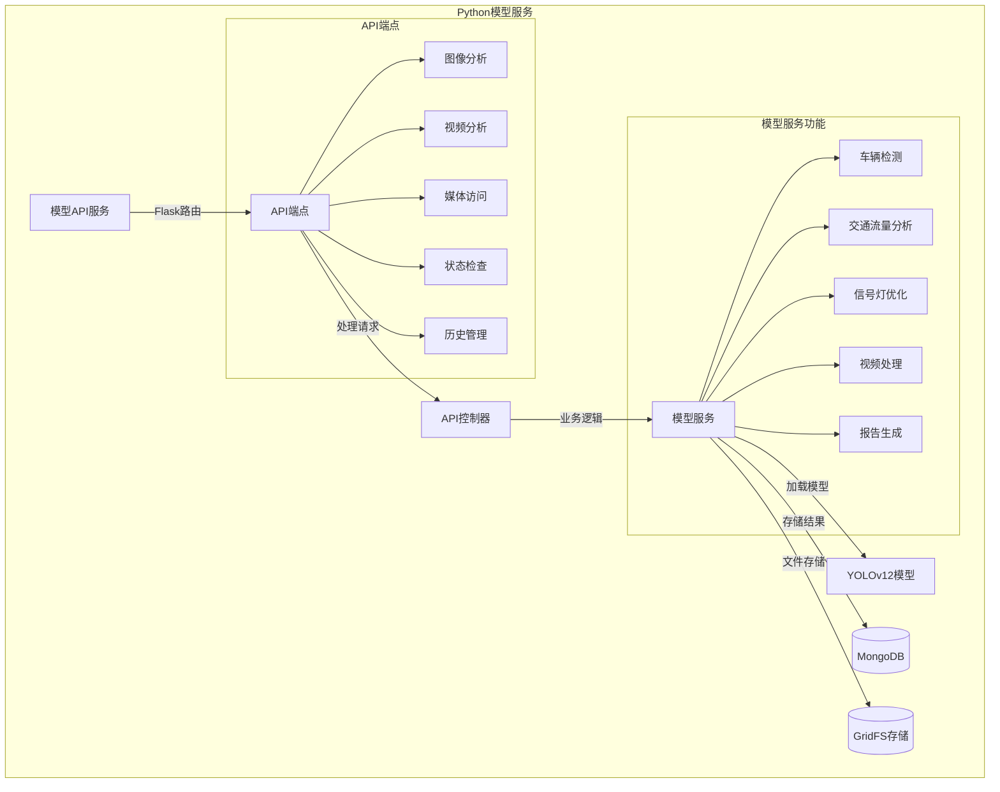
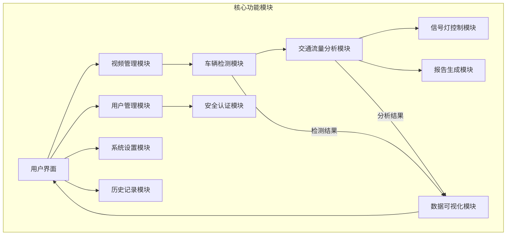
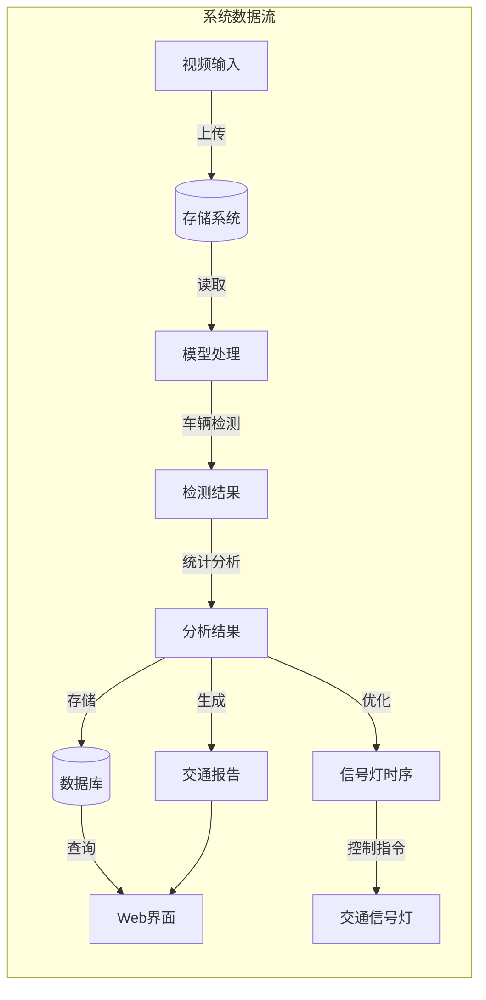
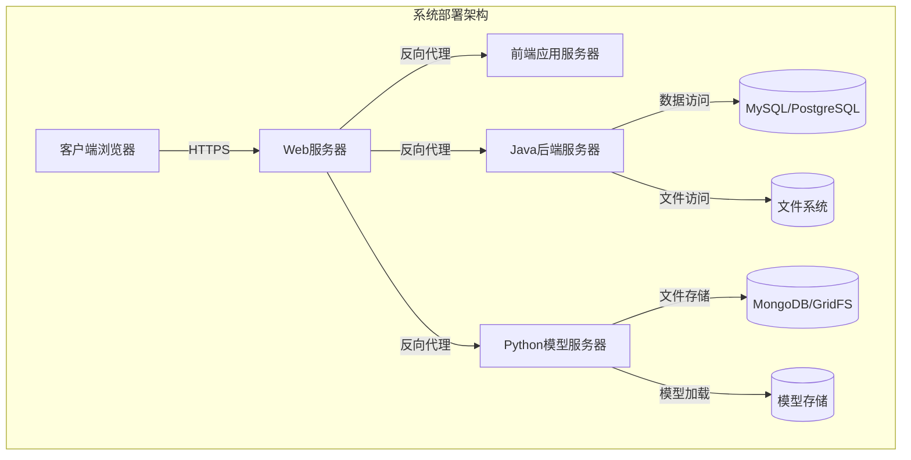

# 基于YOLOv12的交通流量监控和信号灯管理系统结构图

## 系统总体架构图

```mermaid
graph TD
    subgraph "系统整体架构"
        Client[客户端] --> |HTTP/WebSocket| Frontend[前端应用]
        Frontend --> |API调用| Backend[Java后端服务]
        Frontend --> |直接API调用| PythonAPI[Python模型API]
        Backend --> |内部服务调用| PythonAPI
        Backend --> |数据存储/读取| Database[(数据库)]
        PythonAPI --> |加载模型| Model[YOLOv12模型]
        PythonAPI --> |数据存储| FileStorage[(文件存储)]
        Backend --> |文件访问| FileStorage
    end
```

## 前端系统模块图

```mermaid
graph TD
    subgraph "前端系统架构"
        App[App.vue] --> Router[路由管理]
        Router --> |路由| Views[视图组件]
        Views --> |使用| Components[公共组件]
        Views --> |调用| ApiServices[API服务]
        Views --> |状态管理| Store[Vuex存储]
        ApiServices --> |HTTP请求| Backend[后端API]
        
        subgraph "视图模块"
            Views --> Home[首页]
            Views --> Login[登录/注册]
            Views --> VideoUpload[视频上传]
            Views --> VideoResult[视频分析结果]
            Views --> VideoHistory[历史记录]
            Views --> UserManagement[用户管理]
            Views --> PersonalInfo[个人信息]
            Views --> Settings[系统设置]
        end
        
        subgraph "组件模块"
            Components --> CommonComp[通用组件]
            Components --> VideoComp[视频相关组件]
            Components --> AnalysisComp[分析组件]
            Components --> HistoryComp[历史记录组件]
        end
    end
```

## 后端系统模块图

```mermaid
graph TD
    subgraph "后端系统架构"
        SpringBoot[Spring Boot应用] --> |REST控制器| Controllers[控制器层]
        Controllers --> |业务逻辑| Services[服务层]
        Services --> |数据访问| Repository[数据持久层]
        Services --> |调用| PythonServices[Python模型服务]
        Repository --> |ORM映射| Entities[实体对象]
        Controllers --> WebSocket[WebSocket控制器]
        
        subgraph "控制器层"
            Controllers --> AuthController[身份认证]
            Controllers --> AnalysisController[分析控制]
            Controllers --> VideoAnalysisController[视频分析]
            Controllers --> HistoryController[历史记录]
            Controllers --> UserController[用户管理]
            Controllers --> MediaController[媒体管理]
            Controllers --> ApiProxyController[API代理]
            Controllers --> TrafficController[交通管理]
            Controllers --> SystemController[系统管理]
        end
        
        subgraph "服务层"
            Services --> UserService[用户服务]
            Services --> AnalysisService[分析服务]
            Services --> VideoService[视频服务]
            Services --> StorageService[存储服务]
            Services --> SecurityService[安全服务]
            Services --> TrafficService[交通服务]
        end
    end
```

## Python模型服务架构

```mermaid
graph TD
    subgraph "Python模型服务"
        ModelAPI[模型API服务] --> |Flask路由| ApiEndpoints[API端点]
        ApiEndpoints --> |处理请求| Controllers[API控制器]
        Controllers --> |业务逻辑| ModelServices[模型服务]
        ModelServices --> |加载模型| YOLOv12[YOLOv12模型]
        ModelServices --> |存储结果| MongoDB[(MongoDB)]
        ModelServices --> |文件存储| GridFS[(GridFS存储)]
        
        subgraph "API端点"
            ApiEndpoints --> AnalyzeImage[图像分析]
            ApiEndpoints --> AnalyzeVideo[视频分析]
            ApiEndpoints --> MediaAccess[媒体访问]
            ApiEndpoints --> StatusCheck[状态检查]
            ApiEndpoints --> HistoryManage[历史管理]
        end
        
        subgraph "模型服务功能"
            ModelServices --> VehicleDetection[车辆检测]
            ModelServices --> TrafficAnalysis[交通流量分析]
            ModelServices --> SignalOptimize[信号灯优化]
            ModelServices --> VideoProcessing[视频处理]
            ModelServices --> ReportGeneration[报告生成]
        end
    end
```

## 核心功能模块关系图

```mermaid
graph TD
    subgraph "核心功能模块"
        UserInterface[用户界面] --> VideoManagement[视频管理模块]
        VideoManagement --> VehicleDetection[车辆检测模块]
        VehicleDetection --> TrafficAnalysis[交通流量分析模块]
        TrafficAnalysis --> SignalControl[信号灯控制模块]
        TrafficAnalysis --> ReportGeneration[报告生成模块]
        VehicleDetection --> |检测结果| DataVisualization[数据可视化模块]
        TrafficAnalysis --> |分析结果| DataVisualization
        DataVisualization --> UserInterface
        
        UserInterface --> UserManagement[用户管理模块]
        UserManagement --> SecurityModule[安全认证模块]
        UserInterface --> SystemSettings[系统设置模块]
        UserInterface --> HistoryManagement[历史记录模块]
    end
```

## 数据流图

```mermaid
graph LR
    subgraph "系统数据流"
        VideoInput[视频输入] --> |上传| Storage[(存储系统)]
        Storage --> |读取| ModelProcessing[模型处理]
        ModelProcessing --> |车辆检测| Detection[检测结果]
        Detection --> |统计分析| Analysis[分析结果]
        Analysis --> |存储| Database[(数据库)]
        Analysis --> |生成| TrafficReport[交通报告]
        Analysis --> |优化| SignalTiming[信号灯时序]
        Database --> |查询| WebUI[Web界面]
        TrafficReport --> WebUI
        SignalTiming --> |控制指令| TrafficSignal[交通信号灯]
    end
```

## 系统部署架构图

```mermaid
graph TD
    subgraph "系统部署架构"
        Client[客户端浏览器] --> |HTTPS| WebServer[Web服务器]
        WebServer --> |反向代理| FrontendServer[前端应用服务器]
        WebServer --> |反向代理| BackendServer[Java后端服务器]
        WebServer --> |反向代理| PythonServer[Python模型服务器]
        BackendServer --> |数据访问| Database[(MySQL/PostgreSQL)]
        PythonServer --> |文件存储| MongoDB[(MongoDB/GridFS)]
        PythonServer --> |模型加载| ModelStorage[(模型存储)]
        BackendServer --> |文件访问| FileSystem[(文件系统)]
    end
``` 